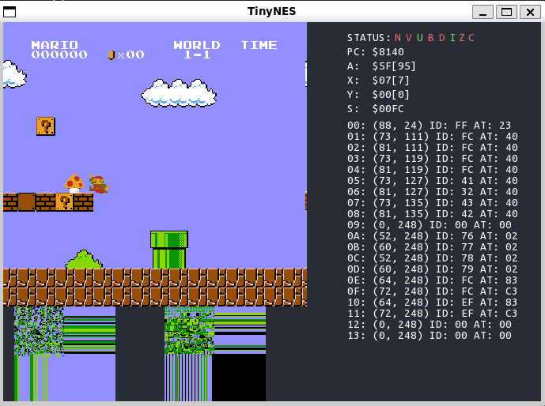

# tinynes

NES emulator based on 6052 CPU written from scratch.
> This project based on [OneLoneCoder/olcNES](https://github.com/OneLoneCoder/olcNES), following rules described in **OneLoneCoder**'s license.

<div class="dino" align="center">
    
    <br>
    <font size="2" color="#999"><u>Tinynes: Super Mario Bro</u></font>
</div>

## Prerequisite

- Ubuntu 20.04 or higher
- CMake 3.14 or higher
- Install SFML2.x for graphic debug.

```bash
sudo apt-get install build-essential
sudo apt-get install libsfml-dev
```

## Usage

```bash
git clone https://github.com/HangX-Ma/tinynes
cd tinynes
cmake -B build -DCMAKE_BUILD_TYPE=Release
cmake --build build -j$(nproc)
# run simulator
./build/demo/demo_ppu
```

You can find `loadCartridge` function and change the `file_path` to switch nes file. Please check demo source code to figure out control logic.

Generally, &uarr;, &darr;, &larr;, &rarr; control the moving directions; `A`, `S`, `Z`, `X` are functional keys; `<space>` starts simulator; `R` resets simulator.

## Schedule

- [x] _**STEP 1**_: Complete 6052 processor instruction set and adapt SFML graphic library
- [x] _**STEP 2**_: Add PPU(Picture Processing Unit) background, foreground and other units like VRAM, Cartridge, etc
- [x] _**STEP 3**_: Add APU(Audio Processing Unit) and develop SFML custom audio stream processing tool
- [ ] _**STEP 4**_: Add more mapper and optimize runtime speed with APU component. _(If possible)_

## NES Emulator Concept

<div class="dino" align="center">
    
    <br>
    <font size="2" color="#999"><u>NES Memory Map</u></font>
</div>

You can find the description of CPU memory map from [NES Dev wiki: CPU memory map](https://www.nesdev.org/wiki/CPU_memory_map). The above picture used as a note to describe the NES emulator system.

All components are linked and managed by the _**main BUS**_. The bus takes the responsibility to transfer data and message. Except the _**main BUS**_, PPU has its own bus to communicates with other graphic related components such as _pattern tables_, _name tables_, _palettes_, etc.

## Reference

- [OneLoneCoder/olcNES](https://github.com/OneLoneCoder/olcNES)
- [NES Dev wiki: NES reference guide](https://www.nesdev.org/wiki/NES_reference_guide)
- [NES Cart Database](https://nescartdb.com)
- [6502 Instruction Set](https://www.masswerk.at/6502/6502_instruction_set.html)

## License

MIT License
